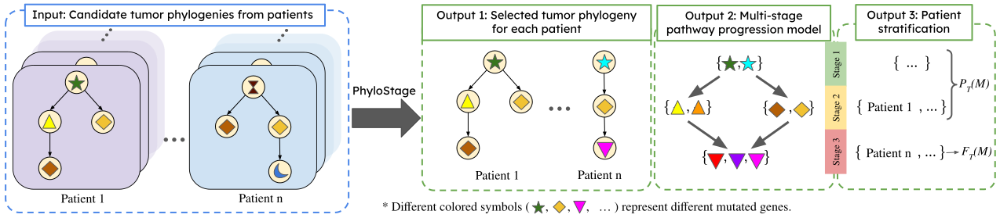

# Inferring Multi-Stage Pathway Progression Models from Tumor Phylogenies

**Overview of PhyloStage.**
PhyloStage takes a family $\mathcal{T}$ of sets of candidate tumor phylogenies for $n$ patients as input. It selects one phylogeny per patient and infers a $k$-stage pathway progression model $M$ ($k = 3$ in the example above), that lexicographically maximizes the pair $(F_{\mathcal{T}}(M), P_{\mathcal{T}}(M))$, where $F_{\mathcal{T}}(M)$ is the number of patients with a tree in which $M$ is fully observed and $P_{\mathcal{T}}(M)$ is the number of patients with a tree in which $M$ is partially observed. Lastly, OurMethod stratifies the patients by their stage of progression according to the inferred model $M$.

## Overview

- PhyloStage infers multi-stage pathway progression models from cohorts of tumor phylogenies, representing cancer evolution as a partial order over pathways.
- PhyloStage supports phylogenies with parallel mutations, incorporates uncertainty across multiple candidate phylogenies per patient, and resolves ambiguous mutation orderings.
- PhyloStage stratifies patients by stage of cancer progression, validated on AML and NSCLC tumor phylogenies.
